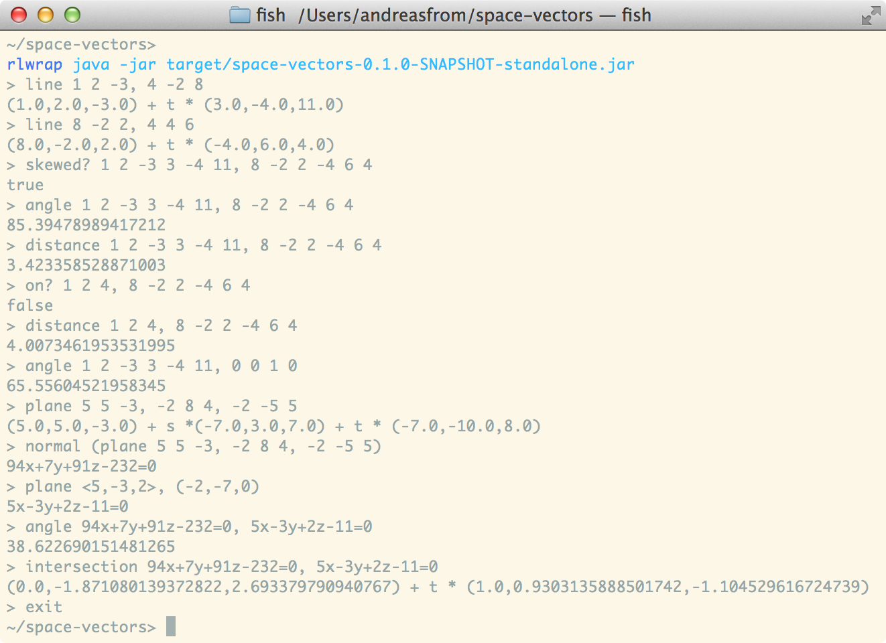

# Space Vectors

A collection of functions and a parser bundled with a GUI to enable faster calculations on vectors, lines and planes in space.

## Sample session

(Picture of the GUI is underway)

## Supported functions
### Vectors
* Length `length a`
* Normalize to a unit vector `normalize a`
* Dot/scalar product `dotp a, b`
* Cross product `cross a, b`
* Area `area a, b`
* Vector between two points (position vectors) `between a, b`

### Lines
* Specify the parameter to get a point on the line `lwith l, t`

### Planes
* Turn a plane of the form `ax+by+cz+d=0` into `(x,y,z) = op+t*r1+s*r2`: `param a`
* Go the other way: `normal a`
* Return three points on a normal-plane `three-points a` 
* Get a point by specifying two parameters `pwith a, t, s`

### Helpers
* Turn two points into a line: `line a, b`
* Get a normal-plane from a vector and a point: `plane n, p`
* Get a parameter-plane from three point: `plane a, b, c`

### Functions between elements
* Angle: `angle x, y`, `parallel? x, y` and `perpendicular? x, y`
* Distance: `distance x, y` and `on? x, y`
* Intersection: `intersection x, y`
* Projection: `projection x, y`
* Are two lines skewed? `skewed? l, m`

## Syntax
### Vectors
All of the following is legal for a vector `(-2,1,3)`
* `(-2,1,3)`
* `(-2, 1, 3)`
* `(-2 1 3)`
* `-2 1 3`
* `-2,1 3`

If there are three numbers, optionally surrounded by "()" and interposed with ",", it's interpreted as a vector.

### Lines
Lines consist of a positional vector, an optional parameter (it's ignored) and a directional vector.
* `(-2,1,3) + t * (1,2,3)`
* `(-2, 1, 3) 1, 2, 3`
* `-2 1 3 1 2 3`

### Planes
* `1x+2y+3z-4=0`
* `1 2 3 -4`

### PPlanes
* `(0,0,0) + t * (1,2,3) s -2 9 17`
* `0 0 0 1 2 3 -2 9 17`

### Commands
Commands consist of one of the above functions and then the arguments separated by comma.
One can nest functions by wrapping them in parenthesis: `dotp 1 2 3, (cross 1 2 -4, 0 4 1)`.

### Example commands
* Distance between two points: `distance (1,2,3), (0,-2,3)`
* Dot product of a point and the cross product of two other: `dotp 0 -2 4, (cross 0 4 1, (1, 2, 4))`
* Intersection of two planes: `intersection -2x+2y-3z+0=0, 4 -2 1 4`

## Binaries
As of 1.0.0-BETA there's now a GUI.
Just download and double-click the jar-file.

[space-vectors.jar](https://www.dropbox.com/s/u1ce92enajqmkel/space-vectors-1.0.0-BETA-standalone.jar)

## Thanks
Thanks to [Instaparse](https://github.com/Engelberg/instaparse) for the extensive documentation and the excellent library for parsing user input.

## License

Copyright © 2013 Andreas From

Distributed under the Eclipse Public License, the same as Clojure.
